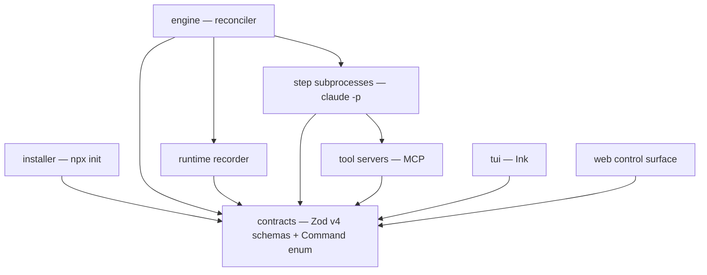
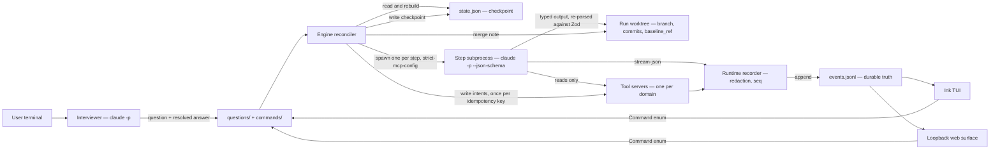
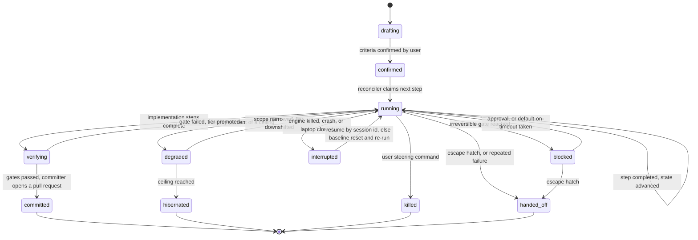
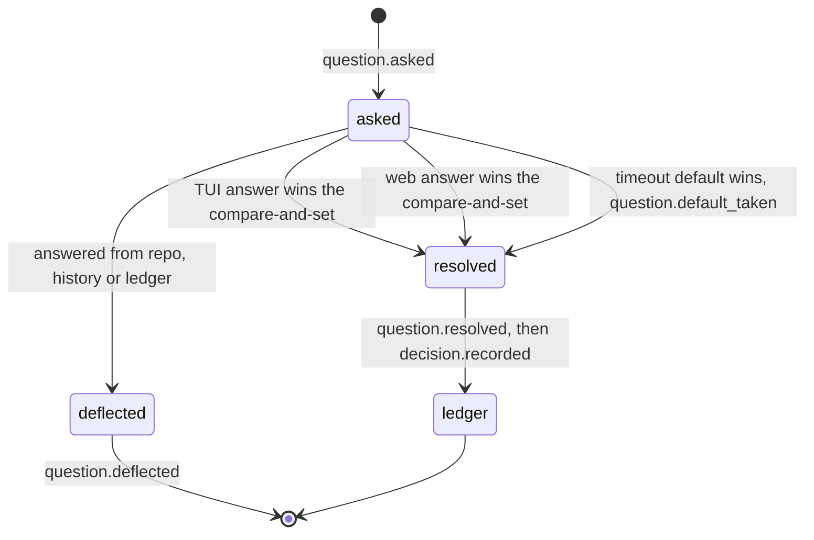

# Architecture Spine — Agent Orchestration System

## Design Paradigm

**Reconciled pipeline.** A controller-style reconciler loop owns durable on-disk state and advances each feature by at most one action per pass; each action is a pure-function pipeline stage executed as an OS subprocess; everything observable is appended to a per-run event log that is the durable truth.

- Crash recovery, instant disengage and the escape hatch are properties of the loop, not shutdown handlers that must be correct.
- Statelessness of a stage is enforced by the process boundary and a recorded baseline commit, not by discipline.
- Every surface — TUI, web, shadow mode, consolidation — is a projection of one log, so no two surfaces can disagree about what happened.

Layer-to-directory mapping is fixed in [Structural Seed](#structural-seed).

## Invariants & Rules

Dependency direction. An arrow means *may depend on*; no edge may be reversed and no cycle may be introduced.



`contracts` depends on nothing. No renderer, step subprocess, tool server or installer may import the engine; renderers reach it only by writing command intent files per AD-19.

### AD-1 — Step agents are `claude -p` subprocesses, never the in-process Agent SDK

- **Binds:** every step agent, the engine, CAP-6, CAP-7, CAP-12, CAP-13
- **Prevents:** one unit embedding the Agent SDK in-process while another shells out, producing two incompatible agent contracts, two permission surfaces and two failure models
- **Rule:** the engine spawns exactly one `claude -p` process per step, passing the step contract with `--json-schema`, consuming `--output-format stream-json`, and passing `--strict-mcp-config` and `--restricted` on every spawn so only engine-supplied MCP servers load and the target repository's own `.mcp.json` and hooks cannot introduce tools or credentials. **Amended by ADR-001:** the spawn happens on the host, with `--add-dir` scoped to the run worktree and `--tools` naming exactly the tools that agent's AD-17 declaration grants — because `--restricted` removes every code-running tool unless `--tools` names them, and CAP-13 requires the deterministic gates to run. The agent's own confinement is therefore configuration-level; the container confines the commands it runs, per AD-20. Bare mode is forbidden positively, not by absence of a flag: the engine asserts subscription authentication at startup and refuses to run if the CLI resolves to API-key mode. The engine re-parses `structured_output` against the originating Zod schema before accepting a step output. No unit may link the Claude Agent SDK as a library; permission plumbing is parsed from the JSON stream.

### AD-2 — One TypeScript package on Node owns engine, TUI and web

- **Binds:** all units
- **Prevents:** engine and renderers speaking different languages, with the step-contract schemas defined twice and drifting apart
- **Rule:** engine, TUI, web control surface and installer live in one TypeScript package; every step contract is a Zod v4 schema in code, exported as `z.toJSONSchema(schema, { target: "draft-7" })` — the target argument is part of this rule, not guidance — and passed to `claude -p --json-schema`. Step contracts stay inside the structured-outputs subset: no `z.date()`, timestamps being `z.string()` carrying the RFC3339 convention; no recursive or self-referential schemas; no `minLength`, no `minItems` greater than one, no `minimum`. No second implementation language is introduced for any unit.

### AD-3 — The web renderer is a control surface, and the TUI alone is sufficient

- **Binds:** CAP-14, CAP-15, both renderers
- **Prevents:** the renderers diverging into a rich web app and a degraded terminal view, or the reverse
- **Rule:** every steering control is a member of a single `Command` enum defined once in `contracts/`, and both renderers are built against that enum, so a control present in one and absent from the other is a compile error. The system must remain fully operable with the web renderer absent; the TUI alone is sufficient and no reply ever requires a browser. The web server binds loopback only and serves a single local user.

### AD-4 — The event log is the durable truth; `state.json` is a rebuildable checkpoint

- **Binds:** CAP-8, CAP-9, CAP-14, CAP-15, CAP-17, CAP-21 and every renderer
- **Prevents:** two named authorities for one fact diverging after a crash, and one unit treating a database or checkpoint as authoritative while another replays the log
- **Rule:** every event is appended as one JSON object on one line and is never mutated; exactly one writer per file per AD-29. `events.jsonl` is the sole durable truth and `state.json` is a checkpoint derived from it; where they disagree the log wins and the checkpoint is discarded and rebuilt. No reader may treat `state.json` as authoritative for anything the log records. Any index or database is a derived projection reconstructable by replay.

### AD-5 — A single event envelope is shared by every emitter

- **Binds:** all units that write or read events
- **Prevents:** each agent, tool server and engine phase inventing its own event shape, which makes one timeline unrenderable and breaks replay
- **Rule:** every line carries `ts`, `seq`, `feature`, `run`, `step`, `emitter`, `type` and `payload`; `ts` is RFC3339 with milliseconds and `seq` is monotonic per file; when the event originates from a `claude -p` stream the original `parent_tool_use_id` and `session_id` are preserved verbatim; readers must ignore unknown types rather than error, so adding an event type is never a breaking change.

### AD-7 — The engine is a reconciler over on-disk state, not an in-memory supervisor

- **Binds:** the engine, every step agent, the worktree/container/resource lifecycle, CAP-5, CAP-6, CAP-23
- **Prevents:** one unit assuming an in-memory owner it can call into while another assumes durable state it can re-read, making crash recovery and the escape hatch behave differently depending on which unit is asked
- **Rule:** the loop reads the checkpoint, takes at most one next action, writes the checkpoint, and holds no authoritative run state in memory; the checkpoint ranks below the log per AD-4. Killing the engine at any instant and restarting it must produce identical behaviour to never having stopped. Idempotency is not asserted but mechanised: by the step baseline of AD-26 for worktree and git effects, and by the idempotency key of AD-15 for external writes.

### AD-8 — Resume by session id only from an `interrupted` disposition

- **Binds:** every step agent, the reconciler, CAP-6, CAP-15
- **Prevents:** one unit assuming resume semantics and another assuming re-run semantics, and the kill control being silently undone by the recovery loop
- **Rule:** the checkpoint records the `claude` session id as soon as the subprocess reports it, and every step termination records a disposition. Only the disposition `interrupted` is resumable: the reconciler attempts `claude -p --resume` with the recorded id and, on failure, re-runs the step from its typed input file after the AD-26 baseline reset. A step terminated by a user steering command records `killed` and is never resumed or re-run by the reconciler.

### AD-9 — Config in-repo, state central, configuration snapshotted per run

- **Binds:** the installer, the engine, both renderers, the profile loader, the resource pool, the worktree lifecycle, CAP-19, CAP-20
- **Prevents:** one unit looking in the repository for something the other writes centrally; and the profile loader reading the main checkout while the step spawner reads a worktree whose feature branch can itself edit `.orch/`
- **Rule:** the installer writes `profile.toml`, `agents/*.toml` and `permissions.toml` into `<target-repo>/.orch/` and appends the runtime paths to `.gitignore`; that directory is the only thing the orchestrator writes inside the target repository besides the feature branch and git notes. All runtime state lives under `ORCH_HOME`, defaulting to `~/.orch`: `runs/<run-id>/`, `worktrees/<run-id>/`, `pool/`, and central project registration and memory at `projects/<project-id>/` keyed per AD-10 — no profile is stored there. A config snapshot is taken once at run start into `runs/<run-id>/config/` and is the only configuration any step of that run reads; mid-run edits to `.orch/` never affect a live run. A prune command must exist to remove central state orphaned by a deleted project directory.

### AD-10 — A project is identified by the SHA of its first commit

- **Binds:** project registration, the profile lookup, memory scoping, every unit resolving a repo to its configuration, CAP-19, CAP-20
- **Prevents:** one unit keying a project by path while another keys it by remote URL or directory name, silently splitting one project into several after a move or rename
- **Rule:** `project-id` is the first-commit SHA, recorded at registration; the filesystem path is a mutable pointer updated on mismatch; a repository with no commits cannot be registered until it has one.

### AD-11 — The executor container image is built locally from a Dockerfile in this repository

- **Binds:** the isolation tiers, the threat-model containment layer, CAP-10, CAP-11
- **Prevents:** one unit expecting a registry-pinned tag while another builds locally, giving two different sandboxes with different hardening
- **Rule:** the image is tagged with the content hash of its Dockerfile and rebuilt automatically when that hash changes and never otherwise; no image is pulled from a registry; the build is the only step permitted network access outside the egress allowlist.

### AD-12 — Distribution is an interactive npx installer run from git

- **Binds:** installation, project onboarding, the replication model, CAP-20
- **Prevents:** divergent setup where one project is scaffolded by hand and another by tool; an unrecoverable half-install; and an engine meeting an older `.orch/` with undefined behaviour
- **Rule:** `npx github:<owner>/<repo> init` is the only supported way to onboard a project — not clone-and-run and not a published npm package; it is interactive, writes only into `<target-repo>/.orch/` and `.gitignore`, and bundles no credential, every user authenticating with their own Claude Code login. It writes a `schema_version` and a manifest of every file it created, so a half-install is detectable and recoverable. Upgrade re-runs the installer, which must be idempotent and must preserve answers already on disk. Stated revisit condition: npm 12 disables git-dependency resolution and install scripts by default, so before npm 12 becomes the bundled npm of a supported Node this delivery path must be re-verified empirically or replaced; the Stack pins npm below 12 until then.

### AD-13 — External domains are one MCP server per domain, and every external read is recorded

- **Binds:** every step agent, every tool server, CAP-3, CAP-7, and the re-run guarantee in AD-8
- **Prevents:** one unit exploring a domain live while another expects its inputs pre-resolved, making the same step non-deterministic across re-runs
- **Rule:** each domain runs as exactly one MCP server passed with `--mcp-config` under the `--strict-mcp-config` of AD-1, holding that domain's credential and no other; agents may explore it freely; the runtime records every request and response, through the redaction pass of AD-21, to the event log and to the run shared fetch record; on re-run the fetch record is served first and the domain is contacted only for a request not already recorded.

### AD-14 — The run shared fetch record is readable by every later step in that run

- **Binds:** all step agents, CAP-6, CAP-9
- **Prevents:** each step re-fetching what an earlier step already pulled, and two steps in one run seeing different versions of the same external record
- **Rule:** a fetch recorded by any step is visible to every subsequent step of the same run and is served from the record rather than re-requested; within one run an external record has exactly one value.

### AD-15 — Agents never write; the engine executes an enumerated write surface

- **Binds:** every step agent, the engine, the committer, CAP-7, CAP-12
- **Prevents:** an agent performing a side effect that AD-8 re-run would double-apply, and two units disagreeing about whether a declared write has already happened
- **Rule:** the write surface is enumerated: `git push`, pull request creation, git notes, tags, and every MCP domain mutation are engine-executed write intents, and none may be performed by an agent; no MCP server exposes a mutating tool. The engine executes each intent exactly once against an idempotency key derived from run id plus intent id. Durability order is fixed: a `write.attempted` record carrying that key is durable before the call; recovery finding `attempted` with no recorded outcome reconciles against the target rather than blindly re-executing.

### AD-16 — The per-repo profile carries project knowledge, and its precedence against repo instructions is fixed

- **Binds:** CAP-20, the bootstrap agent, every step agent, the profile loader
- **Prevents:** the two-sources-of-truth failure where the profile and the repository's own `CLAUDE.md` or `AGENTS.md` disagree and different steps follow different guidance
- **Rule:** the profile is authoritative for mechanics — test, lint, build and run commands, package manager, source layout, resource needs, risk tiers, conflict-domain hints; the repository's own instructions are authoritative for code conventions; where both speak to the same point the repository wins and the profile entry is flagged stale rather than silently applied; profile knowledge sections are additive only and may never contradict the repository; every knowledge entry carries provenance and a decay policy in the vocabulary of `memory-design.md` — permanent, until-refactor, N-features, session — and a re-validation sweep flags entries whose anchors no longer resolve; the profile is authored by the installer and the bootstrap agent, reviewed by the user before first use, and stored at `<target-repo>/.orch/profile.toml` per AD-9.

### AD-17 — The agent roster is declarative configuration referencing registered contracts

- **Binds:** the engine, the installer, every step agent, CAP-20
- **Prevents:** one unit hardcoding the built-in roster while another reads it from config, making a user-defined agent invisible to half the system
- **Rule:** every agent, built-in or user-defined, is declared by one TOML file in `<target-repo>/.orch/agents/` specifying its id, a reference to a registered contract id — never inline schemas, since AD-2 requires every schema to be a Zod schema in code — its granted tools and MCP domains, its reversibility class, and a `model` field declaring a starting tier and a promotion policy, never a fixed assignment. The engine discovers agents only by reading that directory and holds no compiled-in list. Adding an agent that reuses an existing contract requires no engine change; a genuinely new contract shape does. **Amended by ADR-003:** the built-in roster's grants are fixed — `analysis` and `planning` get `Read`/`Grep`/`Glob`; `implementation` and `testing` add `Write`/`Edit`; `verification` gets the read tools without the edit tools, because it must not be able to change what it judges; and `committing` gets no command tool at all, because AD-15 makes pull-request creation, `git push`, notes and tags engine-executed write intents that no agent may perform. No built-in is granted `Task`, `WebFetch` or `WebSearch`. A granted tool name must be a name declared in `src/contracts/`, because ADR-001 made this field security configuration and an undeclared name changes a grant silently. **Amended by ADR-004:** no built-in is granted `Bash`. Command execution is an MCP tool whose server runs the command inside the container, because a granted `Bash` is a host shell that never enters the boundary AD-20 describes.

### AD-18 — No BMad dependency and no BMad files in a target project

- **Binds:** the installer and every unit
- **Prevents:** the design-time toolchain leaking into the runtime product
- **Rule:** nothing under `<target-repo>/.orch/` and no runtime code path may require `_bmad`, a BMad skill or a BMad command.

### AD-19 — Command transport is durable intent files

- **Binds:** both renderers, the engine, every steering control
- **Prevents:** `src/tui` and `src/web` being unbuildable because no path into the engine was named, and one renderer using a socket while the other writes files
- **Rule:** every steering command is a durable intent file written under `runs/<run-id>/commands/` and is the only thing the reconciler consumes; the loopback HTTP plus SSE server is an optional accelerator that writes those same files and streams the event log, never a second command path; every command records its principal so approvals are attributable; with the server down every control remains available through the file path.

### AD-20 — One containment boundary, owned by one wrapper

- **Binds:** CAP-10, the executor, the committer, the threat-model containment layer
- **Prevents:** the container boundary being defined differently by each unit, leaving CAP-10's success criterion untestable
- **Rule:** one wrapper script owns every `docker` invocation and no unit composes its own flags: read-only root filesystem, tmpfs for temp, only the run worktree and its session directory mounted — never `HOME`, ssh or cloud credential paths — non-root user, all capabilities dropped, no-new-privileges, seccomp profile, memory and pid limits.
- **Amended by ADR-001 — what the boundary contains.** The flag set above is unchanged. What is placed inside it is a **command the step runs**, not the `claude -p` process itself: a container per command, started and removed per invocation. The decisive reason is that the Claude subscription credential is held in the macOS keychain rather than a file, so no mount can put it inside a container, and AD-1 refuses API-key mode positively — making an agent-in-container design unsatisfiable on the platform `SPEC.md` names as primary. Arbitrary command execution is also the untrusted party the threat model's containment layer was written for. Consequences accepted: a host-side agent can read files outside the run worktree though it still cannot write them, and `--tools` becomes load-bearing security configuration. One configuration is used on every platform, including Linux where the credential is a file. A step does not run `git`; the engine executes the write surface, as AD-15 already requires. `--rm` is not used while a run is live because it would destroy the session transcript AD-8 resume depends on; removal happens only after the run reaches a terminal disposition. The executor holds no push and no production credential, only the committer may push, force-push is never permitted, and branch protection on the default branch is asserted at run start. A provisioning phase with network precedes execution; execution runs behind the egress allowlist proxy. **Amended by ADR-001:** a command container joins a run-scoped network so a leased CAP-11 service is reachable; that network carries no route to the internet, so the egress intent is unchanged.

### AD-21 — Redaction before append, failing closed

- **Binds:** the runtime recorder and every emitter
- **Prevents:** AD-13's record-everything composing with AD-4's immutability to manufacture a permanent un-redactable secret leak
- **Rule:** every event passes a redaction pass on the boundary between producer and log, covering known token prefixes, high-entropy strings, env-file contents, private-key headers and the literal values of injected credentials; the pass fails closed, dropping the artifact and recording a `redaction.failed` event rather than writing unredacted content. Redaction is a write-path invariant; there is no after-the-fact remedy.

### AD-22 — The in-repository durable record is a git note on the merge commit

- **Binds:** the committer, CAP-8, the SPEC success signal
- **Prevents:** the timeline being irrecoverable from the repository once the worktree and central state are gone
- **Rule:** the committer writes a git note on the merge commit under a single named ref carrying the run id, the ordered step list with dispositions, the acceptance criteria, usage totals and the decisions taken; the note shape is a versioned contract and the committer is its only writer; the note is the durable in-repo record and `events.jsonl` is the full-fidelity record. The committer also owns branch naming: the pattern is declared once in the project profile, defaulting to `feature/<feature-slug>`, the committer is the only unit that creates or names a branch, and no other unit may infer a branch name from a feature slug.

### AD-23 — Control plane and evidence plane are separated

- **Binds:** the engine, every step agent, CAP-9
- **Prevents:** evidence volume entering orchestrator context
- **Rule:** the control plane is the typed step input and output plus the state checkpoint and nothing else, and it alone may enter model context; the evidence plane is transcripts, diffs, fetch records and telemetry, written by the runtime to disk and referenced by pointer; a declared token ceiling bounds the control plane per run, and exceeding it is a hard failure, never a degradation.

### AD-24 — Run ceilings, degradation and hibernation

- **Binds:** CAP-16, the reconciler
- **Prevents:** each unit inventing its own limit semantics
- **Rule:** every run carries three ceilings — step count, wall-clock and consumed rate-limit budget — and no currency dimension. At eighty percent of any ceiling the run degrades by downshifting model tier and narrowing scope, emitting `budget.degraded`. On reaching a ceiling the run hibernates, writing a handoff note and a terminal-pending disposition and emitting `budget.exhausted`, rather than dying mid-write or continuing.

### AD-25 — The question lifecycle is one compare-and-set transition

- **Binds:** the Interviewer, both renderers, CAP-1, CAP-2, CAP-3, CAP-4, CAP-18
- **Prevents:** the three resolvers — TUI answer, web answer, timeout default — racing and poisoning the decision ledger with conflicting answers (**ADR-002**: arbitrated by an exclusive `link(2)` on the outcome file)
- **Rule:** a question is a contract type in `contracts/` with a single state machine; exactly one transition from `asked` to `resolved` is accepted, decided by a compare-and-set on the question state file, later resolvers receiving an already-resolved result; the winning transition records its resolver and principal; only a resolved question writes to the decision ledger; the event vocabulary includes `question.asked`, `question.resolved`, `question.default_taken` and `question.deflected`. **Amended by ADR-002:** the contended artifact is `questions/<id>/outcome.json`, created exclusively with `link(2)` — not the question state file. `state.json` is *derived* from the winning outcome and stands to it as it stands to the event log under AD-4: where they disagree the outcome wins. The reason is that a compare-and-set on the state file must create it exclusively, and the `'wx'`-then-write shape publishes a zero-length file between create and write — the torn read this decision exists to prevent, found in story 1-8 and recorded in three other stories before story 1-12 extracted the fix. `QuestionOutcomeSchema` therefore lives in `contracts/` alongside the question type, and the vocabulary also includes `decision.recorded`, the ledger line a resolved question writes. A losing resolver's *decision* is never accepted; a loser may converge the derived `state.json` to the winner's content, and skips even that when the winner got there first.

### AD-26 — Every step records a baseline commit that re-run resets to

- **Binds:** every step agent, the reconciler, AD-8 re-run safety
- **Prevents:** one implementation re-running against a half-mutated worktree while another hard-resets, one double-applying edits and the other discarding work
- **Rule:** every step records a `baseline_ref`, the exact commit of the run worktree at the instant the step began; re-running a step first resets the worktree to its `baseline_ref`; a step may therefore be re-run any number of times with identical effect.

### AD-27 — Shadow mode is an ordinary run carrying a mode flag

- **Binds:** CAP-21, the stage-3 autonomy gate
- **Prevents:** shadow being built as a replay runner over past events by one unit and as live execution with writes suppressed by another, making the autonomy gate measure different things
- **Rule:** a shadow run is an ordinary run carrying `mode: shadow` in its state; only the intent executor and the committer honour it, by recording every write intent and executing none; every other component behaves identically to a live run.

### AD-28 — Every on-disk contract carries a schema version, and the runtime is pinned

- **Binds:** the installer, the engine, every on-disk artifact, every spawned subprocess
- **Prevents:** an engine meeting an older `.orch/` or an older run layout being undefined behaviour; and a stale version-manager `PATH` silently handing subprocesses a Node below the floor, whose observed failure is an opaque TypeScript syntax error rather than an unsupported-version message
- **Rule:** every on-disk configuration and state artifact carries a `schema_version`; the engine refuses to operate on a version it does not recognise and states which installer version wrote it. Forward compatibility for events is covered by the AD-5 ignore-unknown-types rule; configuration and state have no such latitude. The required Node version is declared once, in `.nvmrc` and the `package.json` `engines` field; the installer and the engine each assert the running Node meets that floor at startup and fail fast naming the required version. The engine resolves the absolute path of a Node executable satisfying the floor, passes that absolute path to every child process rather than relying on `PATH` resolution, and records the resolved version in the run event log.

### AD-29 — Identifier minting and sequence assignment have single owners

- **Binds:** the engine, the runtime recorder, every emitter
- **Prevents:** two units both appending to one `events.jsonl` — concrete where an MCP server is a child of `claude -p` — and unminted or colliding run ids
- **Rule:** run ids are ULIDs minted solely by the engine at run creation; the runtime recorder is the single process that appends to a run's `events.jsonl` and is the sole assigner of `seq`; every other producer, including MCP servers and step subprocesses, emits through the recorder rather than writing the file; ordering is by `seq`, and timestamps carry no ordering authority across processes.

### AD-30 — One engine instance per `ORCH_HOME`

- **Binds:** the engine, the one-writer guarantees in AD-4 and AD-29
- **Prevents:** two concurrently running engines on one `ORCH_HOME` silently interleaving writes
- **Rule:** the engine acquires an exclusive lock file under `ORCH_HOME` at startup and exits with a clear message if it is held; the lock records pid and start time, and a stale lock is reclaimed only after verifying the pid is gone.

### AD-31 — Three test suites are the floor before any unattended run

- **Binds:** every unit of this codebase
- **Prevents:** the named top risk, maintenance burden, arriving through an untested codebase
- **Rule:** every contract in `contracts/` has round-trip tests asserting that its Zod schema, its draft-7 export and a recorded real `structured_output` agree; the reconciler has crash-injection tests that kill it at every state transition and assert AD-7 resume-identical behaviour; the container wrapper has an assertion test proving no push credential and no docker socket are reachable from inside. These three suites are required before any unattended run.

### AD-32 — Lifecycle reclamation is a reconcile action, never a shutdown handler

- **Binds:** the reconciler, the resource pool, the container wrapper, the worktree lifecycle, CAP-11
- **Prevents:** one unit releasing a lease in an exit path a crash skips while another expects the reconciler to reclaim it, stranding containers and leases after every hard kill
- **Rule:** every resource, container and worktree is reclaimed by a reconcile pass comparing live resources against runs, never by a process exiting cleanly; a resource whose run has reached a terminal disposition, or whose run state no longer exists, is reclaimed on the next pass; nothing is reclaimed while its run holds a non-terminal disposition.

### AD-33 — Prune never infers abandonment from a missing path

- **Binds:** prune, project registration, AD-10
- **Prevents:** the reclamation sweep destroying the history of a project that was merely moved, since AD-10 keys projects by first-commit SHA and the recorded path is an explicitly mutable pointer
- **Rule:** an unresolvable project path marks the registration `unlocated` and nothing more; central state is deleted only by an explicit prune naming a `project-id`; re-registering a moved repository reattaches its existing history by first-commit SHA rather than creating a second project.

### AD-34 — Configuration scopes are fixed and disjoint

- **Binds:** the installer, the engine, both renderers, the memory layer, CAP-19
- **Prevents:** two units disagreeing about which file answers a question, and leaves no per-machine setting or cross-repo memory without a declared home
- **Rule:** machine scope is `ORCH_HOME/config.toml`, holding ports, paths, docker endpoint and machine defaults, and is never committed; project scope is `<target-repo>/.orch/` and is committed; run scope is the immutable snapshot at `runs/<run-id>/config/` per AD-9 and is the only configuration a step reads; cross-project memory is `ORCH_HOME/memory/`, because it spans projects and can belong to no repository. A value is declared in exactly one scope; there is no merging and no overriding between scopes.

### AD-35 — Every failure code carries a declared disposition

- **Binds:** every unit emitting the error shape, the reconciler acting on it
- **Prevents:** two units treating the same failure differently, one retrying what another abandons
- **Rule:** the error shape `code`, `message`, `retryable`, `cause` is accompanied by a disposition table in `contracts/` beside the error schema, mapping every code to exactly one of retry-with-backoff, escalate-model-tier, escalate-to-human, or abandon-and-hand-off; an unknown code is treated as abandon-and-hand-off and never retried.

## Consistency Conventions

| Concern | Convention |
| --- | --- |
| Naming (entities, files, interfaces, events) | Event type names are dot-namespaced and past-tense. The vocabulary includes `step.started`, `agent.tool_used`, `fetch.recorded`, `write.attempted`, `write.executed`, `permission.denied`, `redaction.failed`, `budget.degraded`, `budget.exhausted`, `question.asked`, `question.resolved`, `question.default_taken`, `question.deflected`. Feature slugs are kebab-case. Step ids are stable declared names, never positional indexes. Readers ignore unknown event types rather than erroring. |
| Data & formats (ids, dates, error shapes, envelopes) | Run id is a ULID minted by the engine per AD-29; `project-id` is the first-commit SHA per AD-10. All timestamps are RFC3339 with milliseconds in UTC, carried as `z.string()` because `z.date()` is outside the structured-outputs subset. Every failure crossing a unit boundary uses the shape `code`, `message`, `retryable`, `cause`, and every code appears in the AD-35 disposition table. Human-edited configuration is TOML; machine-owned state and events are JSON; every on-disk artifact carries a `schema_version` per AD-28. Every schema is defined once as a Zod v4 schema and exported with `z.toJSONSchema(schema, { target: "draft-7" })` — never with default arguments, since Zod 4 defaults to draft-2020-12 and the `--json-schema` validator rejects it. Step contracts use no recursive or self-referential schemas, no `minLength`, no `minItems` greater than one and no `minimum`. |
| State & cross-cutting (mutation, errors, logging, config, auth) | One writer per file: only the reconciler writes a `state.json`, only the runtime recorder appends to an `events.jsonl`, only the committer writes the git note; one engine per `ORCH_HOME` per AD-30. State writes are atomic — temporary file in the same directory, then rename. Event lines are never mutated and every event passes redaction before append. No unit writes diagnostics to stdout; everything observable goes to the event log. Reconciliation is concurrent across features but serializes any features whose declared file territories overlap. Auth is the user's own Claude Code subscription login via non-bare `claude -p`, asserted at startup; no `ANTHROPIC_API_KEY` path and no bundled credential. |

## Stack

| Name | Version |
| --- | --- |
| Node.js | `>=22.22`; 24.x LTS recommended. 22.18 is the true minimum, being where native TypeScript type stripping lands, which the `bin/init.ts` npx entry point requires |
| TypeScript | 5.9.3 — the last line shipping the compiler API, so the repository can lint itself |
| React | 19.3.0 — required by Ink; the web control surface reuses it rather than adding a second UI paradigm |
| react-dom | 19.3.0 |
| Vite | 8.3.0 — bundler for the web control surface |
| Vitest | 5.0.1 — runner for the AD-31 verification floor |
| typescript-eslint | 8.70.0 — peers `typescript >=4.8.4 <6.1.0`, which is what excludes TypeScript 7 |
| Zod | 4.6.5 — `z.toJSONSchema(schema, { target: "draft-7" })` |
| Ink | 7.1.1 — ESM-only; peers `react` and `@types/react` `>=19.2.0`, `react-devtools-core` `>=6.1.2` |
| `claude` CLI | `>=2.1.259` — the max of `--permission-prompts` at 2.1.259, cross-project `--resume` at 2.1.223, `--mcp-config` connect-before-first-turn at 2.1.221, nested-subagent stream events at 2.1.219 |
| Docker Engine | `>=29.7` |
| Model rungs | `claude-haiku-4-5` → `claude-sonnet-5` → `claude-opus-5`; one promotion per step per run, on a failed verification gate or a second schema-invalid output |
| npm | `<12` — npm 12 disables git-dependency resolution and install scripts by default, which breaks the AD-12 delivery path |

## Structural Seed

The orchestrator package — one TypeScript package; directories map one-to-one onto the paradigm's layers.

```text
agent-orcastrator/
  bin/
    init.ts        # npx github:<owner>/<repo> init entry point, AD-12
  src/
    installer/     # interactive prompts, .orch/ scaffolding, manifest, schema_version
    contracts/     # Zod v4 schemas, Command enum, question type, event envelope, error shape
    engine/        # reconciler, roster discovery, spawner, ceilings, intent executor, lock
    runtime/       # recorder: redaction, seq assignment, events.jsonl, fetch record
    container/     # the single docker wrapper, AD-20
    tui/           # Ink renderer, built against the Command enum
    web/           # loopback HTTP + SSE accelerator, built against the Command enum
    tools/         # one MCP server per external domain; jira first
  templates/       # .orch/ skeletons the installer writes; no BMad file ever, AD-18
  tests/           # the three AD-31 suites: contracts, crash injection, container assertion
  docker/
    Dockerfile     # tier-2 executor image, built locally, tagged by content hash
```

Committed configuration the installer writes into a target repository, per AD-9, AD-12, AD-17:

```text
<target-repo>/
  .orch/
    profile.toml       # mechanics + project knowledge, AD-16
    permissions.toml   # granted tools, reversibility gates, egress allowlist
    manifest.toml      # schema_version + every file the installer created, AD-12, AD-28
    agents/
      <agent-id>.toml  # one file per agent, referencing a registered contract id, AD-17
  .gitignore           # installer appends the runtime paths; .orch/ itself is committed
```

Runtime state layout, per AD-9 — never inside a target repository:

```text
$ORCH_HOME/                     # default ~/.orch
  config.toml                   # machine scope: ports, paths, docker endpoint; never committed, AD-34
  engine.lock                   # exclusive, pid + start time, AD-30
  memory/                       # cross-project pattern memory; belongs to no repository, AD-34
  runs/<run-id>/
    events.jsonl                # append-only; sole writer is the runtime recorder, AD-29
    state.json                  # rebuildable checkpoint; sole writer is the reconciler, AD-4
    config/                     # per-run config snapshot taken at run start, AD-9
    commands/                   # durable steering intent files, AD-19
    questions/                  # <id>/outcome.json is the contended artifact; state.json is derived (AD-25, ADR-002)
    fetch-record.json           # run shared external fetch record, AD-13 / AD-14
  worktrees/<run-id>/           # reclaimed by a reconcile pass at terminal disposition, AD-20, AD-32
  pool/                         # leased ephemeral resources, reclaimed by reconcile, AD-32
  projects/<project-id>/        # registration pointer and per-project ledger; keyed by AD-10, AD-33
```

A feature run:



Feature state lifecycle, as recorded in the checkpoint:



Question lifecycle, per AD-25 — one accepted transition, three possible resolvers:



Losing resolvers receive an already-resolved result, and no losing resolver's decision is ever accepted (ADR-002).

## Capability → Architecture Map

| Capability / Area | Lives in | Governed by |
| --- | --- | --- |
| CAP-1, CAP-2, CAP-3, CAP-4 — conversation, spec echo, question compression, default-on-timeout | Interviewer session as a `claude -p` process; question contract in `src/contracts`, state files under `runs/<run-id>/questions/` | AD-25, AD-1, AD-13 |
| CAP-5, CAP-23 — mode visibility, disengage, escape hatch, handoff | `src/engine` reconciler, `runs/<run-id>/commands/`, both renderers | AD-7, AD-19, AD-8, AD-35 |
| CAP-6 — deterministic orchestration and step re-run | `src/engine` reconciler, `src/contracts` | AD-1, AD-7, AD-8, AD-26, AD-13, AD-14 |
| CAP-7 — capability-scoped tool access | `src/tools` MCP servers, engine spawn arguments | AD-13, AD-15, AD-1 |
| CAP-8 — git as message bus | committer, git note on the merge commit | AD-22, AD-4, AD-15 |
| CAP-9 — control and evidence plane separation | `src/engine` control plane, `src/runtime` evidence plane | AD-23, AD-4, AD-5 |
| CAP-10 — tiered isolation | `src/container` wrapper, `docker/Dockerfile` | AD-20, AD-11 |
| CAP-11 — ephemeral pooled resources | `src/engine` reclamation pass, `pool/` | AD-32, AD-20, AD-9 |
| CAP-12, CAP-13 — reversibility-tiered autonomy, test-first verification | `src/engine` gates, verification step agents | AD-15, AD-17, AD-1, AD-8 |
| CAP-14, CAP-15 — two renderers, steerability | `src/tui`, `src/web`, the `Command` enum in `src/contracts` | AD-19, AD-3, AD-4, AD-5 |
| CAP-16 — cost governance | `src/engine` ceiling enforcement, `src/runtime` usage events | AD-24, AD-23, AD-5 |
| CAP-17, CAP-18 — consolidation, decision ledger | consolidation pass over `runs/`, ledger under `projects/<project-id>/` | AD-4, AD-9, AD-10, AD-25, AD-33 |
| CAP-19 — cross-repo pattern memory | `ORCH_HOME/memory/` | AD-34, AD-10, AD-4 |
| CAP-20 — universal engine, per-repo profile and agent roster | `bin/init.ts` and `src/installer`; roster discovery and profile loader in `src/engine` | AD-9, AD-12, AD-16, AD-17, AD-18, AD-28 |
| CAP-21 — shadow mode | ordinary run carrying `mode: shadow`; intent executor and committer | AD-27, AD-15, AD-4 |
| CAP-22 — morning brief and ambient status | `src/tui`, fold over `events.jsonl` | AD-4, AD-3, AD-24 |

## Deferred

- **A SQLite query index over the event log.** Safe: AD-4 makes any index a derived projection reconstructable by replay, so introducing or losing one changes no unit's interface. Build it when a shadow-mode or trust-record query exceeds two seconds scanning JSONL, or when one project passes roughly two hundred runs — whichever comes first.
- **The npm 12 delivery path.** Safe: AD-12 states the revisit condition and the Stack pins npm below 12, so no unit may assume the newer behaviour. The fallback is pre-decided rather than left open: if npm 12 becomes the bundled npm of a supported Node line and git-dependency resolution is confirmed off by default, distribution moves to `git clone` plus `npm run init --target`. AD-12 is unaffected, because it fixes what the installer produces, not how it is fetched.
- **TypeScript 7 adoption.** Safe: the Stack pins 5.9.3 and nothing depends on 7's behaviour. Adopt when typescript-eslint publishes a peer range including the 7.x line — its exclusion, not the compiler, is the blocker, and the repository must be able to lint itself because `memory-design.md` converts conventions into lint rules.

Four items previously deferred here are now decided and live elsewhere: the web renderer framework and bundler, and the model-ladder rungs and promotion rule, are in **Stack** above; the shadow-mode accuracy threshold and the installer question set are in `build-sequencing.md`.
